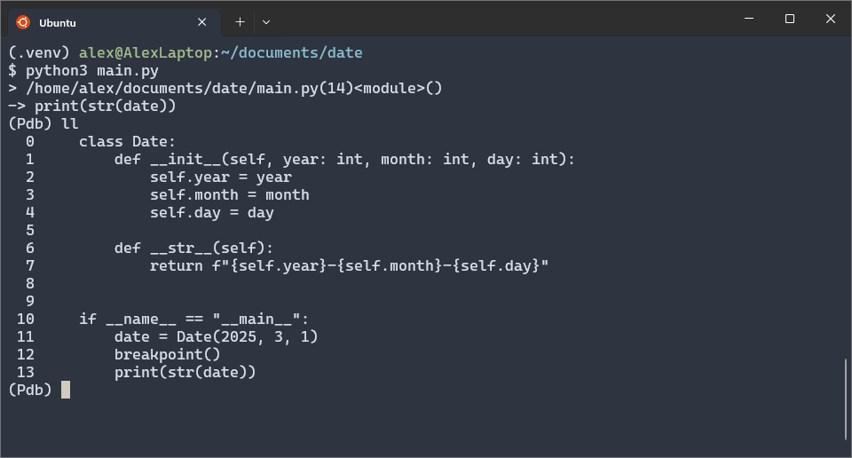
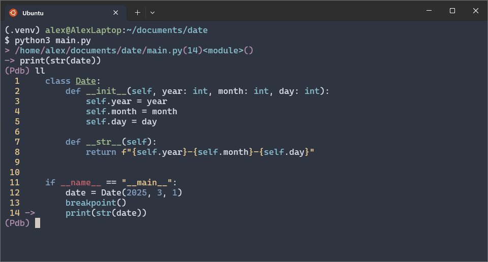

# PDB Color

Add some color to the python debugger.

Using PDB:



Using PDB Color:



## Installation

Install with `pip`.

```shell
pip install pdbcolor
```

## Setup

Python can be configured to use PDB Color by changing the `PYTHONBREAKPOINT`
environment variable. To use PDB Color temporarily, add the 
`PYTHONBREAKPOINT=pdbcolor.set_trace` prefix before running your python script:

```shell
PYTHONBREAKPOINT=pdbcolor.set_trace python3 main.py
```

To make PDB Color the default for all Python sessions, set the
`PYTHONBREAKPOINT` environment variable to `pdbcolor.set_trace`. On Mac and
Linux, you can do this with the `export` command:

```shell
export PYTHONBREAKPOINT=pdbcolor.set_trace
```

Add this line to your terminal configuration file (e.g. `.bashrc` or `.zshrc`)
to ensure the setting persists across terminal settings.

## Autocomplete

PDB Color also has autocompletion by default which can be triggered using the
TAB key. For example:

```python
$ python3 main.py
> /home/alex/documents/pdbcolor/main.py(9)<module>()
-> y = 2
(Pdb) str.
str.capitalize(    str.isalpha(       str.ljust(         str.rpartition(
str.casefold(      str.isascii(       str.lower(         str.rsplit(
str.center(        str.isdecimal(     str.lstrip(        str.rstrip(
str.count(         str.isdigit(       str.maketrans(     str.split(
str.encode(        str.isidentifier(  str.mro()          str.splitlines(
str.endswith(      str.islower(       str.partition(     str.startswith(
str.expandtabs(    str.isnumeric(     str.removeprefix(  str.strip(
str.find(          str.isprintable(   str.removesuffix(  str.swapcase(
str.format(        str.isspace(       str.replace(       str.title(
str.format_map(    str.istitle(       str.rfind(         str.translate(
str.index(         str.isupper(       str.rindex(        str.upper(
str.isalnum(       str.join(          str.rjust(         str.zfill(
(Pdb) str.
```

## Pytest

To use PDB Color with pytest, use `--pdbcls=pdbcolor:PdbColor`. For example:

```shell
python3 -m pytest --pdbcls=pdbcolor:PdbColor
```

This drops you into PDB Color when a breakpoint is reached.

If you get a pytest OS error such as:

```shell
OSError: pytest: reading from stdin while output is captured!  Consider using `-s`.
```

Using the `-s` flag stops the error but, for those interested, the error is
usually caused by setting `PYTHONBREAKPOINT=pdbcolor.set_trace`. Changing this
back to its default value should stop the error without needing the `-s` flag.
For example:

```shell
PYTHONBREAKPOINT=pdb.set_trace python3 -m pytest --pdbcls=pdbcolor:PdbColor
```

To save on typing, consider adding the following aliases to your terminal
configuration file:

```shell
alias pdb='PYTHONBREAKPOINT=pdb.set_trace'
alias pdc='PYTHONBREAKPOINT=pdbcolor.set_trace'
```

The previous command then becomes:

```shell
pdb python3 -m pytest --pdbcls=pdbcolor:PdbColor
```
